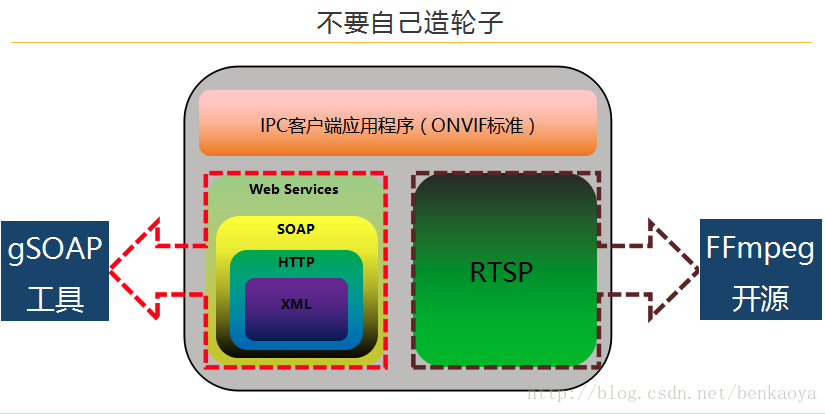
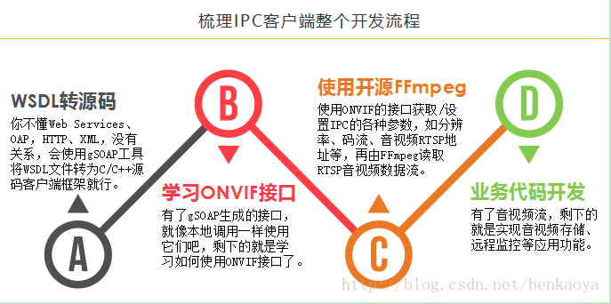
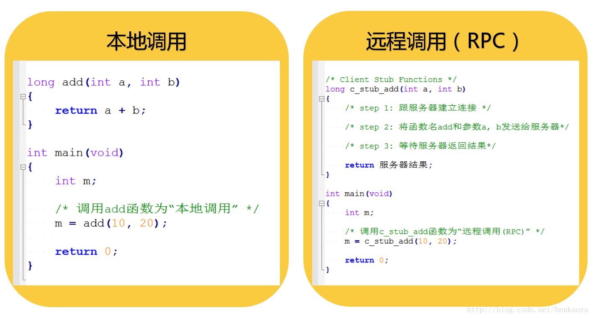
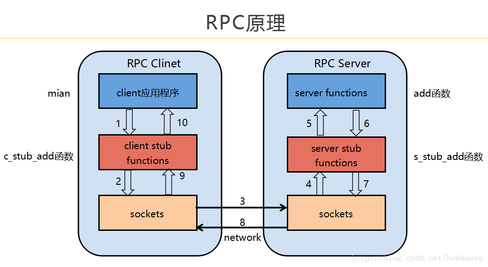
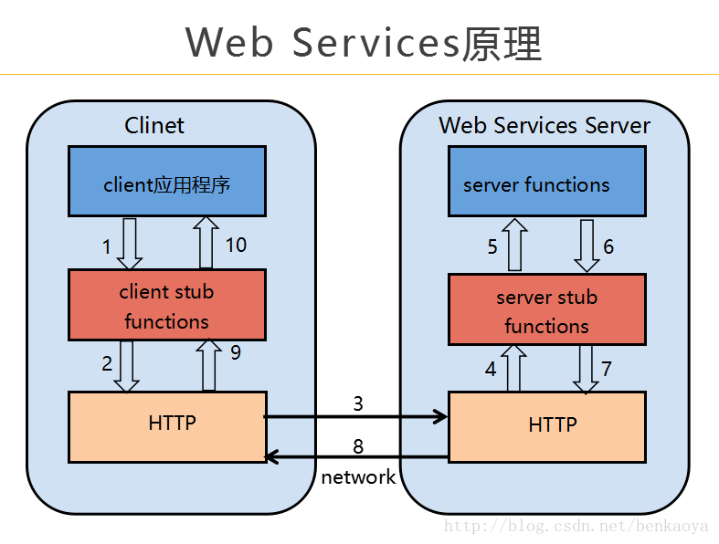
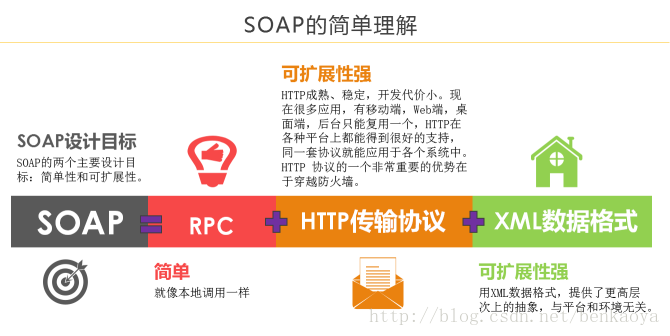
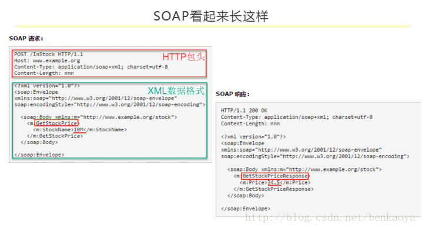

# 概述
- ONVIF规范中设备管理和控制部分所定义的接口均以Web Services的形式提供。ONVIF规范涵盖了完全的XML及WSDL的定义。每一个支持ONVIF规范的终端设备均须提供与功能相应的Web Service。服务端与客户端的数据交互采用SOAP协议。ONVIF中的其他部分比如音视频流则通过RTP/RTSP进行。
- ONVIF = 服务端 + 客户端 =（Web Services + RTSP）+ 客户端 = （（WSDL + SOAP） + RTSP） + 客户端
- WSDL是服务端用来向客户端描述自己实现哪些请求、发送请求时需要带上哪些参数xml组织格式；SOAP是客户端向服务端发送请求时的参数的xml组织格式
- Web Services实现摄像头控制（比如一些参数配置、摄象头的上下左右（PTZ）控制）；RTSP实现报像头视频传输
- Web Services具摄像头控制具体到技术交互实现上，其实和http差不多，客户端以类似http post的格式向服务端发送请求，然后服务端响应客户端请求。
- SOAP协议 = RPC机制 + HTTP传输协议 + XML数据格式
- 比如GetStatus请求长这样（POST的data部份就是soap格式）：
```
POST /onvif/device_service HTTP/1.1
Host: 192.168.220.128
Content-Type: application/soap+xml; charset=utf-8
Content-Length: 333

<?xml version="1.0" encoding="utf-8"?>
<s:Envelope xmlns:s="http://www.w3.org/2003/05/soap-envelope" xmlns:tptz="http://www.onvif.org/ver20/ptz/wsdl" xmlns:tt="http://www.onvif.org/ver10/schema">
  <s:Body>
    <tptz:GetStatus>
      <tptz:ProfileToken>prof0</tptz:ProfileToken>
    </tptz:GetStatus>
  </s:Body>
</s:Envelope>
```
- SOAP 是Simple Object Access Protocol 的缩写. 是基于XML的一种协议,是建立再HTTP基础上的.一条SOAP消息就是一个普通的XML 文档

# ONVIF规范的内容
- 设备发现
- 设备管理
- 设备输入输出服务
- 图像配置
- 媒体配置
- 实时流媒体
- 接收端配置
- 显示服务
- 事件处理
- PTZ控制
- 其他

# WSDL
WSDL是Web services 描述语言（Web Service Description Language）的缩写。是一种基于xml的网络服务描述语言，用来描述Web服务和说明如何与Web服务通信的XML语言，为用户提供详细的接口说明书。
```
<span data-wiz-span="data-wiz-span" style="font-size: 1rem;"><?xml version='1.0' encoding='UTF-8'?>
<wsdl:definitions name="HelloWorld"
    targetNamespace="http://server.cxf.webservice.web.apps.lucl.com/"
    xmlns:xsd="http://www.w3.org/2001/XMLSchema"
    xmlns:wsdl="http://schemas.xmlsoap.org/wsdl/"
    xmlns:tns="http://server.cxf.webservice.web.apps.lucl.com/"
    xmlns:soap="http://schemas.xmlsoap.org/wsdl/soap/"
    xmlns:ns1="http://schemas.xmlsoap.org/soap/http"
    >
    <!-- 定义数据类型 -->
    <wsdl:types>
        <xs:schema xmlns:xs="http://www.w3.org/2001/XMLSchema"
            xmlns:tns="http://server.cxf.webservice.web.apps.lucl.com/"
            elementFormDefault="unqualified"
            targetNamespace="http://server.cxf.webservice.web.apps.lucl.com/"
            version="1.0">
            <xs:element name="sayHi" type="tns:sayHi" />
            <xs:element name="sayHiResponse" type="tns:sayHiResponse" />
            <xs:complexType name="sayHi">
                <xs:sequence>
                    <xs:element minOccurs="0" name="arg0" type="xs:string" />
                </xs:sequence>
            </xs:complexType>
            <xs:complexType name="sayHiResponse">
                <xs:sequence>
                    <xs:element minOccurs="0" name="return" type="xs:string" />
                </xs:sequence>
            </xs:complexType>
        </xs:schema>
    </wsdl:types>
    <!-- 定义消息分组 -->
    <wsdl:message name="sayHiResponse">
        <wsdl:part element="tns:sayHiResponse" name="parameters" />
    </wsdl:message>
    <wsdl:message name="sayHi">
        <wsdl:part element="tns:sayHi" name="parameters" />
    </wsdl:message>
    <!-- 定义port type -->
    <wsdl:portType name="HelloWorldPortType">
        <wsdl:operation name="sayHi">
            <wsdl:input message="tns:sayHi" name="sayHi" />
            <wsdl:output message="tns:sayHiResponse" name="sayHiResponse" />
            <!-- 指定当 Web 服务设法响应客户机的请求时所发生的任何消息级异常 -->
            <!--
            <wsdl:fault name="" message=""></wsdl:fault> 
            -->
        </wsdl:operation>
    </wsdl:portType>
    <!-- binding操作到特定协议，即关联portType到协议，这里为SOAP -->
    <!-- W3C 推荐了三个 Web 服务的绑定：
            HTTP 上的 SOAP（SOAP over HTTP）
            HTTP GET/POST
            SOAP/MIME
    -->
    <wsdl:binding name="HelloWorldSoapBinding" type="tns:HelloWorldPortType">
        <soap:binding style="document" transport="http://schemas.xmlsoap.org/soap/http" />
        <wsdl:operation name="sayHi">
            <soap:operation soapAction="" style="document" />
            <wsdl:input name="sayHi">
                <soap:body use="literal" />
            </wsdl:input>
            <wsdl:output name="sayHiResponse">
                <soap:body use="literal" />
            </wsdl:output>
            <!-- 应用portType处的fault -->
            <!--
            <wsdl:fault name="">
            <soap:fault name="" use="literal"/>
            </wsdl:fault> 
            -->
        </wsdl:operation>
    </wsdl:binding>
    <!--
        描述binding的连接信息,根据绑定所实现的 portType 来处理请求。
        对于 HTTP 上的 SOAP，这就是指向那个进程的 URL。
    -->
    <wsdl:service name="HelloWorld">
        <wsdl:port binding="tns:HelloWorldSoapBinding" name="HelloWorldPort">
            <soap:address location="http://localhost:9000/helloWorld" />
        </wsdl:port>
    </wsdl:service>
</wsdl:definitions></span>
```
# 接口规范
ONVIF接口被划分为不同模块，包括：设备发现、设备管理、设备输入输出服务、图像配置、媒体配置、实时流媒体、接收端配置、显示服务、事件处理、PTZ控制等。

每个模块的接口都有相对应的WSDL文档进行描述，可以在ONVIF官网「Network Interface Specifications」中查阅，链接如下：
https://www.onvif.org/profiles/specifications/

如果想快速浏览ONVIF所有模块的常用接口，请看这里「ONVIF 2.0 Service Operation Index」，链接如下：
https://www.onvif.org/onvif/ver20/util/operationIndex.html

注意：这里仅仅是列出常用接口，不是全部接口，每个模块的全部接口需要进入每个模块的WSDL中去看，点击任意一个接口就会自动跳转到对应的WSDL文档链接处。

比如说GetServices接口以上页面没有显示，但在http://www.onvif.org/ver10/device/wsdl/devicemgmt.wsdl中是的。所以想看全部的接口，还是得深入每个wsdl才行啊。

# 开发流程




# 工具
- ONVIF Device Test Tool

# RPC


被调用方法的具体实现不在同一个进程，而是在别进程，甚至别的电脑上。RPC一个重要思想就是，使远程调用看起来像本地调用一样，调用者无需知道被调用接口具体在哪台机器上执行。

# webservice


# SOAP


这个一个股票Web Services服务系统，其中GetStockPrice接口适用于查询股票当前价格，图中查询了IBM的股票价格，Web Services返回股票价格为34.5

